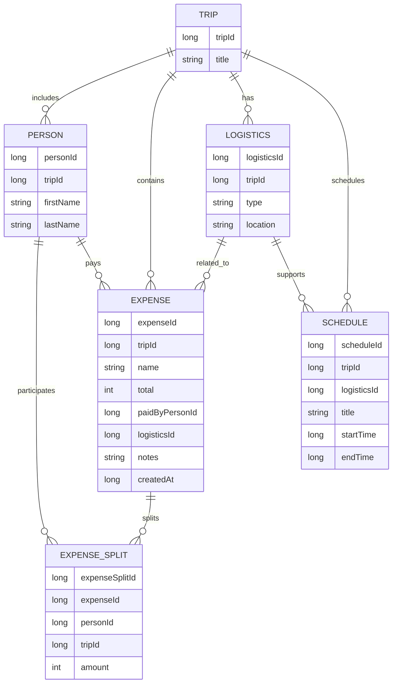
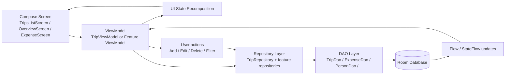

# Trip Planner Architecture Overview

## Purpose
This project is a single-module Android trip planning app built with Jetpack Compose. It combines trip management, logistics, schedules, people, and expense tracking into one application backed by Room persistence. The architecture emphasizes a clear separation between UI, domain/data access, and navigation, while keeping the codebase compact enough for a small app.

## Data structure diagram

This diagram summarizes the app’s core relational model: each trip owns people, logistics, schedule items, and expenses; each expense can be associated with a payer and one or more split entries for different people.

## High-level structure

### Application entry
- `app/src/main/java/com/example/tripplanner/MainActivity.kt`
  - Launches the app and renders `TripPlannerApp()` inside `TripPlannerTheme`.
- `app/src/main/java/com/example/tripplanner/ui/theme/TripPlannerApp.kt`
  - Sets up the root navigation graph.
  - Creates `TripDependencies` from the application context.
  - Handles the transitions between the trips list, account screen, and trip detail screen.

### Navigation model
- `app/src/main/java/com/example/tripplanner/ui/theme/core/navigation/Routes.kt`
  - Defines the top-level navigation destinations:
    - `trips`
    - `account`
    - `trip/{tripId}`
- `app/src/main/java/com/example/tripplanner/ui/theme/trip/TripNavGraph.kt`
  - Registers the trip-scoped tab destinations:
    - Overview
    - Expense
    - Logistics
    - Schedule
    - More
- `app/src/main/java/com/example/tripplanner/ui/theme/trip/navigation/TripTab.kt`
  - Encapsulates each tab as a route with a label and icon.

## UI layer
The app is built in Compose rather than XML layouts.

### Top-level screens
- `TripsListScreen.kt`
  - Displays the list of trips as selectable cards.
  - Navigates into a selected trip using the trip ID.
- `AccountScreen.kt`
  - Provides account-related UI.
- `TripScaffold.kt`
  - Hosts the trip-level app bar and bottom navigation.
  - Receives a `TripViewModel` and wires it into the trip area.

### Feature screens
- `OverviewScreen.kt`
  - Shows summary metrics such as total expenses, participant count, and upcoming events.
  - Displays logistic grouping by type.
- `ExpenseScreen.kt`
  - Displays a total expense summary card and expense list.
  - Allows creation of new expenses via a floating action button and dialog.
  - Shows delete and select interactions for each card.
- `LogisticsScreen.kt`, `ScheduleScreen.kt`, `MoreScreen.kt`
  - Feature-specific screens under the trip detail flow.

## State and view models
The app uses ViewModel + StateFlow patterns for reactive UI state.

### Shared trip state
- `app/src/main/java/com/example/tripplanner/ui/theme/trip/TripViewModel.kt`
  - Central ViewModel for data scoped to a single trip.
  - Exposes flows for:
    - `expenses`
    - `people`
    - `logistics`
    - `events`
    - `totalExpense`
    - `expensesWithSplits`
    - `errorMessage`
    - `isLoading`
  - Maintains the selected tab route via `SavedStateHandle`.

This ViewModel pulls from `TripRepository` and converts Room query streams to UI-friendly `StateFlow`s using `stateIn`.

### Dependency injection pattern
- `TripDependencies.kt`
  - Provides repository instances through a `CompositionLocal`.
  - Supplies access to:
    - `tripRepository`
    - `expenseRepository`
    - `expenseSplitRepository`
    - `logisticsRepository`
    - `personRepository`
    - `scheduleRepository`

This pattern keeps screen code from creating its own database references repeatedly.

## Data layer

### Database
- `app/src/main/java/com/example/tripplanner/data/db/TripDatabase.kt`
  - Defines the Room database configuration.
  - Includes entities for:
    - `TripEntity`
    - `ExpenseEntity`
    - `ScheduleEntity`
    - `LogisticsEntity`
    - `PersonEntity`
    - `ExpenseSplitEntity`
  - Current database version: 8

### Database provider
- `app/src/main/java/com/example/tripplanner/data/db/DatabaseProvider.kt`
  - Implements the singleton Room database builder.
  - Creates the database at `trip_planner.db`.

### DAO layer
Under `app/src/main/java/com/example/tripplanner/data/dao/`:
- `TripDao.kt`
- `ExpenseDao.kt`
- `ExpenseSplitDao.kt`
- `PersonDao.kt`
- `LogisticsDao.kt`
- `ScheduleDao.kt`

These interfaces handle inserts, updates, deletes, and query logic for each entity group. The DAO layer is where the app’s SQL logic lives.

### Repository layer
Under `app/src/main/java/com/example/tripplanner/data/repository/`:
- `TripRepository.kt`
  - Acts as the aggregate repository for trip-scoped operations.
  - Delegates to specialized repositories for people, logistics, schedule, expenses, and expense splits.
- `ExpenseRepository.kt`
- `ExpenseSplitRepository.kt`
- `LogisticsRepository.kt`
- `PersonRepository.kt`
- `ScheduleRepository.kt`

This keeps database access focused and makes the ViewModel layer cleaner.

## Runtime data flow diagram

This flow reflects the app’s reactive pattern: user actions trigger ViewModel methods, repositories query or write through DAOs, and Room emits new data streams back into Compose state so the screen redraws.

## Domain entities

The app has six primary Room entities that drive the core data model:

- `TripEntity`
- `PersonEntity`
- `ExpenseEntity`
- `ExpenseSplitEntity`
- `LogisticsEntity`
- `ScheduleEntity`

### Trip entity
- `TripEntity`
  - Represents the trip itself.
  - Typically includes identifying metadata such as title and trip ID.

### Person entity
- `PersonEntity`
  - Represents a traveler on the trip.
  - Usually tracks names and trip ownership.

### Expense entity
- `ExpenseEntity.kt`
  - Fields include:
    - `expenseId`
    - `tripId`
    - `name`
    - `total`
    - `paidByPersonId`
    - `logisticsId`
    - `notes`
    - `createdAt`
  - Includes foreign keys to `TripEntity`, `PersonEntity`, and `LogisticsEntity`.

### Split entity
- `ExpenseSplitEntity.kt`
  - Captures a per-person share of an expense.
  - Includes `expenseId`, `personId`, `tripId`, and `amount`.
  - Defines an `ExpenseWithSplits` relation to map an expense plus all of its split rows.

### Logistics entity
- `LogisticsEntity`
  - Represents transport or travel-related logistical items.
  - Can be linked to trip activities, expenses, and schedule entries.

### Schedule entity
- `ScheduleEntity`
  - Represents a planned activity or time block for the trip.
  - Can reference a logistics item via `logisticsId` and belongs to a trip.

## Architecture patterns in use
This app follows a common Android architecture for a small-medium project:

- UI: Jetpack Compose
- Navigation: Navigation Compose
- State: ViewModel + `StateFlow`
- Persistence: Room + DAO + repositories
- Shared app dependencies: composition locals / trip-scoped dependency provider

The result is a clean, readable app structure where each layer has a distinct job:
- Compose handles rendering and interaction
- ViewModels manage state and coordinate business actions
- Repositories wrap DAOs and domain operations
- Room persists the trip data

## Notable implementation notes
- `TripRepository` is the central service for trip operations and delegates to feature-specific repositories.
- `TripDependencies` is used to inject repositories into screens and ViewModels where needed.
- `ExpenseScreen` implements a custom dialog-based add-expense flow with a floating action button.
- The project already includes more advanced data concepts such as split logic and `ExpenseWithSplits`, even though some of the more elaborate UI features are still under development.

## Future feature roadmap from GitHub issues
The issue backlog shows the project direction and likely next phases.

### 1. Expense feature completion
Issues around expense management indicate the app is still tightening its core transactional capabilities:
- Add and validate expense forms (#41, #42, #43, #44)
- Edit an existing expense (#47, #48, #49, #50, #51)
- Delete an expense and related splits (#52, #53, #54, #55, #56)

These issues suggest expense creation, editing, and deletion are active feature work.

### 2. Expense detail and split breakdowns
This is a major feature area for the app:
- View detailed expense information (#31, #32, #33, #34)
- Display split breakdowns per person (#35, #36, #37, #38, #39, #40)

This strongly aligns with the presence of the `ExpenseSplitEntity` and `ExpenseWithSplits` domain types.

### 3. Filtering, sorting, and grouping UX
The backlog is especially strong in expense list usability improvements:
- Filter total expenses by payer (#57, #58, #59, #60)
- Filter split expenses by person (#61, #62)
- Sort by creation date (#63, #64, #65)
- Group expenses by payer/person (#66, #67, #68, #69, #70, #71)

These issues indicate a push toward making the expense list easier to reason about as trip data grows.

### 4. Budget and spending summaries
There are also design goals around trip financial awareness:
- Display total trip expenses (#15, #16, #17, #18)
- Show spending vs. budget per person (#19, #20, #21, #22, #23, #24, #25, #26)

This aligns with the product goal of acting as a practical travel expense tracker.

### 5. Core schema and entity evolution
Earlier backlog items show the data model was still being expanded:
- Implement Room database (#6)
- Add `name` to expense entity (#9)
- Add `date` to expense entity (#12)

This reinforces that the schema is evolving alongside the product roadmap.

## Summary
The project currently follows a pragmatic and clean Android architecture: Compose UI, Navigation Compose, ViewModel + StateFlow, and Room for persistence. The code is modular enough for future extension, and the issue backlog makes it clear that the next major development areas are richer expense experiences, better split reporting, filtering/sorting/grouping UX, and budgeting views.
